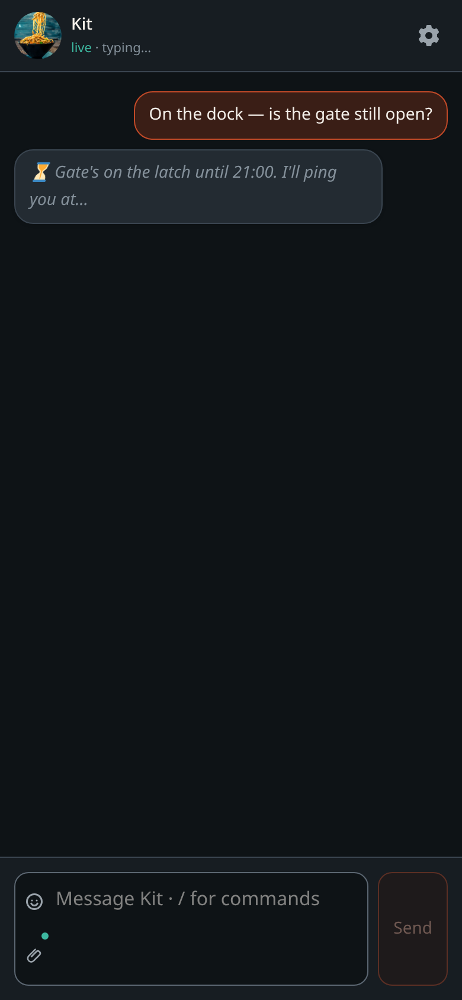
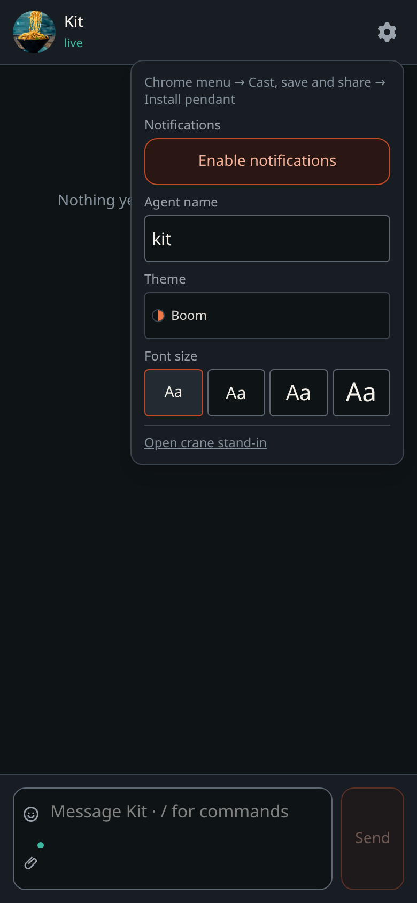
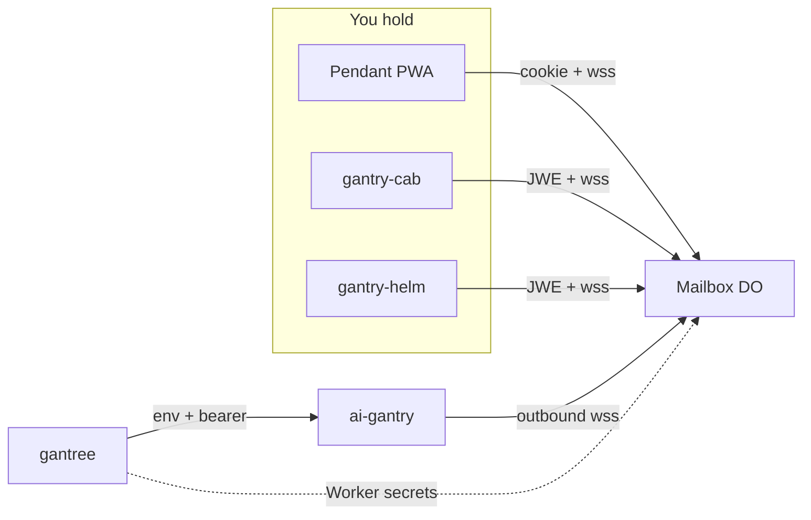

#  gantry-pendant

<p align="center">
  
</p>

<p align="center">
  <a href="https://github.com/shotah/gantry-pendant/actions/workflows/ci.yml"></a>
  <a href="https://github.com/shotah/gantry-pendant/actions/workflows/ci.yml"></a>
  <a href="https://github.com/shotah/gantry-pendant"></a>
  <a href="LICENSE"></a>
</p>

> **gantry** *(n.)* — the rigid frame that holds and positions tools.
>
> **pendant** *(n.)* — the handheld control on that crane. You walk the
> floor with it. You do not sit in the yard office.

You talk to Kit. Kit is an
[ai-gantry](https://github.com/shotah/ai-gantry) process: one persona,
one model, tools you granted, memory you can `sqlite3`. Telegram is
the mailbox *today* because Telegram is always on and the crane only
dials **out**. Nothing on the Mini listens. That rule does not change.

This repo is that loop on a phone we own. A Vinext PWA. A Durable
Object room on Cloudflare. A new harness channel next to Telegram.
[gantree](https://github.com/shotah/gantree) still operates the crane
— build, grants, recreate. It never sits in a chat turn.
[gantry-cab](https://github.com/shotah/gantry-cab) is the same room in
the car. [gantry-helm](https://github.com/shotah/gantry-helm) is the
same room on an iPhone. One Worker. Zero inbound ports.

```text
PWA / Cab / Helm  →  this Worker (Google + Durable Object)  ←  crane (outbound)
```

The handset only needs HTTPS. The Mini does not have to be the
mailbox. Home internet can die and you can still leave a note; Kit
thinks again when the crane has net.

<p align="center">
  
  &nbsp;
  
  &nbsp;
  
</p>

<p align="center">
  
  &nbsp;
  
  &nbsp;
  
</p>

Every screen, Lamp, Paper, extra-large type, crane stand-in:
[docs/screens.md](docs/screens.md). Reshoot with `npm run shot`.

## The household

Five checkouts. One product. Nested under gantree (`repos/…`), each
with its own git remote — same pattern as `repos/ai-gantry`.



| Repo | Job |
| --- | --- |
| **this** (`app/` + `worker/`) | Chat UI, Google door, PWA. Durable Object room per crane slug. Deploys **code** only. |
| [gantry-cab](https://github.com/shotah/gantry-cab) | Android + Auto mouth. Same frames, same room. Not a TWA wrapping this UI. |
| [gantry-helm](https://github.com/shotah/gantry-helm) | iOS + CarPlay mouth. Same frames, same room. Not a WKWebView wrapping this UI. |
| [ai-gantry](https://github.com/shotah/ai-gantry) | The crane. Completer, PERSONA, MCP. `CHANNEL=pendant` is a sibling of Telegram. |
| [gantree](https://github.com/shotah/gantree) | Operator board. Writes `.env`, mints the bearer, ticks who may talk. Never in the token path. |

Gantree Settings → Pendant pushes Google / session onto the Worker.
Build mints a bearer per crane. The crane publishes who may talk when
it dials. The Worker is the room, not a second allowlist.

Sister READMEs tell the same household from their side. Cab for the
Android car. Helm for the iPhone. Gantree for the yard. This one for
the handheld and the mailbox.

Wire, queue, `ack` / `since` / `seq`:
[docs/architecture.md](docs/architecture.md) ·
[docs/frontends.md](docs/frontends.md). Voice is a mouth skin — OS STT
in, OS / Auto TTS out. No audio on the wire:
[docs/voice.md](docs/voice.md).

## Docs

The plan lives here, not in chat.

| If you want… | Go here |
| --- | --- |
| Open work | [docs/todo.md](docs/todo.md) |
| Bugs / security by phase | [docs/audit_todo.md](docs/audit_todo.md) |
| What the mouth looks like | [docs/screens.md](docs/screens.md) |
| What you paste where | [docs/setup.md](docs/setup.md) |
| First `workers.dev` | [docs/deployment.md](docs/deployment.md) |
| Cab and Helm | [docs/frontends.md](docs/frontends.md) |
| The crane end of the wire | [docs/backends.md](docs/backends.md) |
| Why this shape | [docs/design.md](docs/design.md) |
| How the sockets meet | [docs/architecture.md](docs/architecture.md) |
| Two principals | [docs/security.md](docs/security.md) |
| Cross-repo gotchas | [docs/edgecases.md](docs/edgecases.md) |
| Dictate / hear Kit | [docs/voice.md](docs/voice.md) |

## Hello

```bash
cp .dev.vars.example .dev.vars   # MAILBOX_SECRET + PENDANT_DEV
npm install
npm test
npm run lint                     # ESLint + markdownlint, writes fixes
npm run dev                      # http://127.0.0.1:3000 — Chrome can Install from here
```

Loopback with `PENDANT_DEV=1`: mock Ada, no Google. `/?sample=thread`
(and `stream`, `emoji`, `ping`, `photo`, `empty`, …) paints canned
scenes. Compose without a sample gets canned Kit replies. Type the
spike secret to join the real room.

Open two tabs: `/` (phone) and `/crane` (crane stand-in). Same slug,
same secret. Type in one, see it in the other.

```bash
npm run shot                     # assets/docs/*.png — needs `npm run dev`
npm run secret                   # mint a loopback bearer / mailbox secret
# npm run secrets:push           # leftover — Gantree Settings owns workers.dev secrets
npm run deploy                   # after `npm run build` — workers.dev (laptop)
npm run release                  # bump patch, tag, push (GitHub Release + Workers)
npm run release:dry              # print the next tag only
```

**This repo deploys Worker code.** Google / `SESSION_SECRET` /
`CRANE_BEARERS` are **Gantree Settings → Pendant** and Build (mint a
bearer per crane). Bind KV `DIRECTORY`. `ALLOWED_SUBS` is optional
break-glass. Empty crane list fails boot. The spike secret is rejected
once Google is on. GitHub Actions deploys on `main` and `v*` tags; CI
never sees Worker app secrets.

Google is a **new Web application** client (`openid email profile`),
same GCP project as google-mcp is fine. Not Desktop, not
`oauth-catch`, not `localhost:4100`. Table:
[docs/setup.md](docs/setup.md#once-before-any-person).

Leftover, no yard: `.env` + `npm run secrets:push`. Do not mix that
with Gantree after the yard owns `CRANE_BEARERS`.

Crane env (`CHANNEL=pendant`) is written by Gantree:

```env
PENDANT_MAILBOX_URL=wss://gantry-pendant.<account>.workers.dev/ws/kit
PENDANT_BEARER=<bound to kit>
PENDANT_ALLOWED_USERS=<email or google-sub>
```

Yard: Settings → Pendant once, then Build channel **pendant**, tick
who may talk, recreate. No bearer paste. The console cookie never goes
to this Worker. First Workers ship: [docs/deployment.md](docs/deployment.md).
Then [docs/setup.md](docs/setup.md).

## This is not

- A mobile layout of [gantree](https://github.com/shotah/gantree). That
  board already opens in a phone browser. Pretty yard UI is a different
  track.
- Chat through the console HTTP API.
- An inbound port on the crane.
- The Gantree **portal** Worker (yard skin). Different Worker, different
  auth, never `docker.sock`.
- A hosted SaaS or App Store listing.
- google-mcp OAuth (Gmail/Drive). That is a tool grant, not phone login.

Telegram stays the production mouth until this path works on one
crane.
