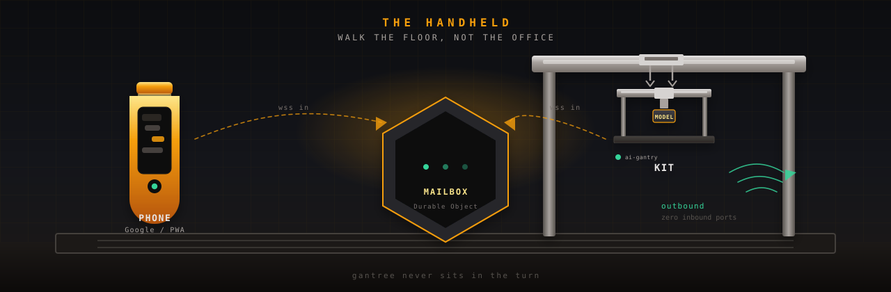
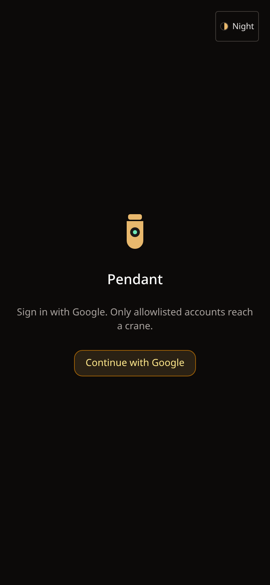
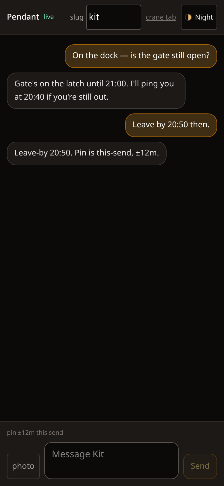
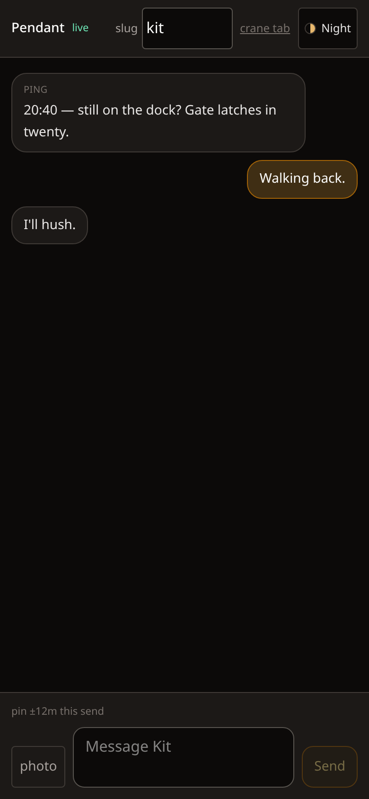
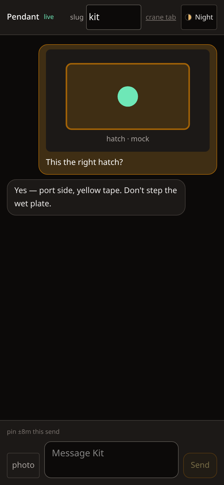

#  gantry-pendant

<p align="center">
  
</p>

<p align="center">
  <a href="https://github.com/shotah/gantry-pendant/actions/workflows/ci.yml"></a>
  <a href="https://github.com/shotah/gantry-pendant/actions/workflows/ci.yml"></a>
  <a href="https://github.com/shotah/gantry-pendant"></a>
  <a href="LICENSE"></a>
</p>

> **gantry** *(n.)* — the rigid frame that holds and positions tools.
>
> **pendant** *(n.)* — the handheld control on that crane. You walk the
> floor with it. You do not sit in the yard office.

A chat mouth for [ai-gantry](https://github.com/shotah/ai-gantry) that we
own. Not the yard board. Not Telegram. Jewelry is the other English
sense; the prefix is the crane.

Today you message Kit on Telegram. The crane dials **out**; nothing
listens. This repo is that loop on a phone we control: a Vinext app,
a Durable Object mailbox, a new harness channel. Gantree still
operates cranes. It does not sit in a chat turn.

```text
phone  →  Vinext on Cloudflare Workers (Google login + Durable Object)  ←  crane (outbound)
```

The phone only needs HTTPS. The crane still opens **zero** inbound
ports. The Mini does not have to be the mailbox.

<p align="center">
  
  &nbsp;
  
  &nbsp;
  
  &nbsp;
  
</p>

Every screen, Day theme, crane stand-in: [docs/screens.md](docs/screens.md).

**Docs (the plan lives here, not in chat):**

| File | What it is |
| --- | --- |
| [todo.md](todo.md) | Phases, walks, which repo |
| [docs/screens.md](docs/screens.md) | What the mouth looks like (phone shots) |
| [docs/setup.md](docs/setup.md) | Admin / user / connect — what you paste where |
| [docs/edgecases.md](docs/edgecases.md) | Gotchas across pendant + gantree + ai-gantry |
| [docs/design.md](docs/design.md) | Why this shape, Worker vs Mini, phone context (GPS), walk |
| [docs/architecture.md](docs/architecture.md) | How the three pieces talk |
| [docs/security.md](docs/security.md) | Two principals, Google OIDC in the Vinext app vs Access vs MCP |

Nested checkout under gantree (`repos/gantry-pendant`), own git
remote, same pattern as `repos/ai-gantry`.

## Hello

```bash
cp .dev.vars.example .dev.vars   # MAILBOX_SECRET + PENDANT_DEV
npm install
npm test
npm run dev                      # http://127.0.0.1:3000
```

Loopback with `PENDANT_DEV=1`: mock Ada, no Google. `/?sample=thread`
(and `ping`, `photo`, `empty`, …) paints canned scenes.
Compose without a sample gets canned Kit replies. Type the spike
secret to join the real room.

Open two tabs: `/` (phone) and `/crane` (crane stand-in). Same slug,
same secret. Type in one, see it in the other.

```bash
npm run shot                     # assets/docs/*.png — needs `npm run dev`
npm run secret                   # mint a bearer / mailbox secret
npm run deploy                   # after `npm run build` — workers.dev
npm run release                  # bump patch, tag, push (GitHub Release)
npm run release:dry              # print the next tag only
```

Google login is a **new Web application** client on the same GCP
project as google-mcp. Scopes: `openid email profile` only. Redirect:
`https://<this-origin>/api/auth/callback/google` — not the Pages
`oauth-catch` URI, not `localhost:4100`. Put `GOOGLE_CLIENT_ID` /
`GOOGLE_CLIENT_SECRET` / `SESSION_SECRET` / `ALLOWED_SUBS` /
`CRANE_BEARERS` in Worker secrets. Empty allowlist is a config error.
The spike secret is rejected once Google is on.

Crane env (`CHANNEL=pendant`):

```env
PENDANT_MAILBOX_URL=wss://gantry-pendant.<account>.workers.dev/ws/kit
PENDANT_BEARER=<bound to kit>
PENDANT_ALLOWED_USERS=<google-sub>
```

Yard: pick **pendant** in the build wizard, paste those three, recreate.
The console cookie never goes to this Worker. Gantree does **not** write
Worker secrets and does not store a Google `sub` on the operator.
End-to-end after deploy: [docs/setup.md](docs/setup.md).

## This is not

- A mobile layout of [gantree](https://github.com/shotah/gantree). That
  board already opens in a phone browser. Pretty yard UI is a different
  track.
- Chat through the console HTTP API.
- An inbound port on the crane.
- The Gantree **portal** Worker (yard skin). Different Worker, different
  auth, never `docker.sock`.
- A hosted SaaS or App Store listing.
- google-mcp OAuth (Gmail/Drive). That is a tool grant, not phone login.

## Three pieces

| Piece | Repo | Job |
| --- | --- | --- |
| Client | **this repo** (Vinext `app/`) | Chat UI. Google sign-in. PWA. Same framework as Gantree, **Workers** target. |
| Relay | same Worker (Durable Object) | Mailbox per crane. Phone and crane both dial **in**. |
| Channel | **ai-gantry** `CHANNEL=pendant` | Same `Channel` / `Pusher` as Telegram. Allowlist. Cron can still ping you. |

Telegram stays the production mouth until this path works on one crane.
