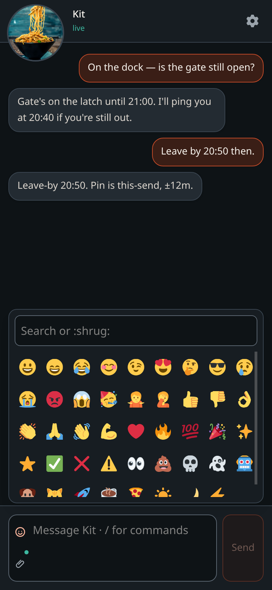
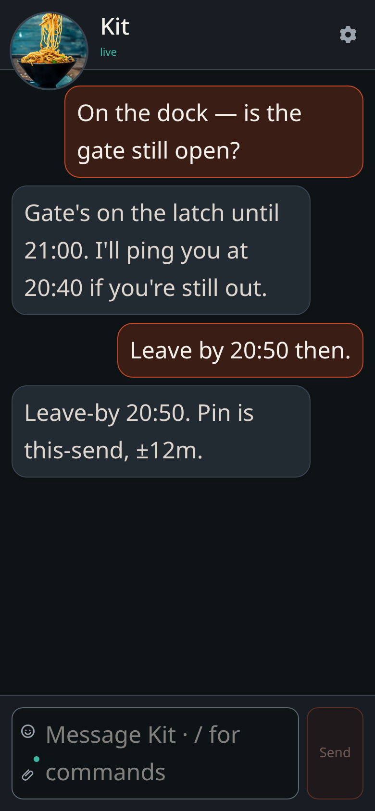
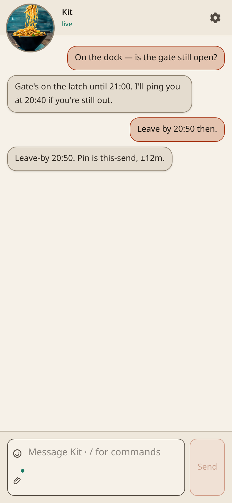
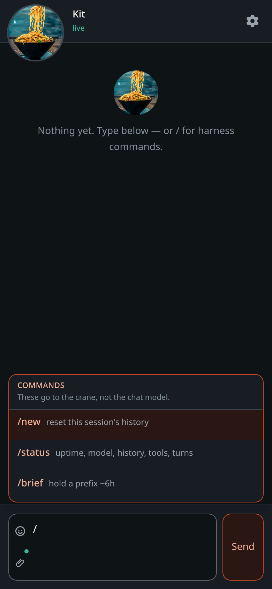
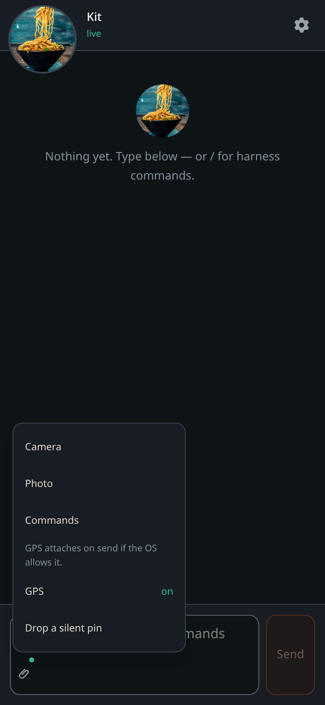

# Screens

What the mouth looks like. Pitch: [root readme](../README.md). Why:
[design.md](design.md). Reshoot: `PENDANT_DEV=1` in `.dev.vars`,
`npm run dev`, then `npm run shot`.

Loopback only. `PENDANT_DEV` is ignored on `workers.dev`. Samples are
canned Ada/Kit turns — not a live crane.

---

## Phone

The product viewport is a pocket (390×844). Theme defaults to Boom
(twelve ids; Paper is the light workshop). Chat type defaults to Small;
Extra large is a shot. Kit’s face is an 82 px circle that hangs off the
header (tap to replace it). Compose has emoji on the left, attach under
it — photo sits on the draft until Send. Empty and unsigned screens use
the same mark. Fallback is the pendant glyph until a JPEG is saved on
the Durable Object.

<p align="center">
  
  &nbsp;
  
  &nbsp;
  
</p>

<p align="center">
  
  &nbsp;
  
  &nbsp;
  
</p>

<p align="center">
  
  &nbsp;
  
  &nbsp;
  
</p>

<p align="center">
  
  &nbsp;
  
  &nbsp;
  
</p>

<p align="center">
  
  &nbsp;
  
  &nbsp;
  
</p>

<p align="center">
  
</p>

| Shot | URL | What it is |
| --- | --- | --- |
| `login` | `/login` | Google door. The crane decides who may talk. |
| `unsigned` | `/?sample=unsigned` | Same gate inside the shell. |
| `empty` | `/?sample=empty` | Live, nothing said yet. Emoji + paperclip. |
| `cmds` | `/?sample=cmds` | Command picker. Live list is published by the crane (`cmds` frame); this sample paints a short stand-in. |
| `attach` | `/?sample=empty` then paperclip | Camera, photo, commands, GPS, silent pin. |
| `thread` | `/?sample=thread` | Ada ↔ Kit. Pin is this-send. |
| `stream` | `/?sample=stream` | Crane typing + italic draft bubble (⏳). |
| `emoji` | `/?sample=emoji` | Same thread with the emoji tray open. |
| `ping` | `/?sample=ping` | Cron `Push` — labeled **ping**. |
| `photo` | `/?sample=photo` | Inbound image + text. |
| `down` | `/?sample=down` | Other side gone. Compose locked. |
| `thread-day` | `/?sample=thread&theme=lamp` | Lamp theme. |
| `thread-paper` | `/?sample=thread&theme=paper` | Paper (light). Boom / Inlay / Lamp stay shared with gantree. |
| `thread-xl` | `/?sample=thread&font=xl` | Extra-large chat type. Small is the default. |
| `settings` | `/?sample=empty` | Cog — theme, follow Kit’s mood, font, photo size, backdrop, Install. |
| `crane` | `/crane?sample=crane` | Loopback stand-in for the harness (`PENDANT_DEV`). |

---

## Dev mouth

`.dev.vars`:

```bash
cp .dev.vars.example .dev.vars
npm run dev                      # http://127.0.0.1:3000 (Chrome Install works on loopback)
```

`PENDANT_DEV=1` on loopback:

- `/api/auth/me` returns mock Ada (`1182…` / `ada@example.com`, `cranes: ["ada"]`). No Google.
- `/?sample=<id>` paints a scene (no WebSocket).
- Without a sample, compose is live and Kit answers with canned lines.
- Type the spike **secret** to join the real Durable Object (two-tab
  `/` + `/crane`) the way [README](../README.md) already describes.

```bash
npm run shot                     # all scenes → assets/docs/
npm run shot -- thread ping      # a subset
```

Chrome is headless CDP (same trick as gantree). Override the binary
with `CHROME=`. Never set `PENDANT_DEV` as a Worker secret on
`workers.dev`.
